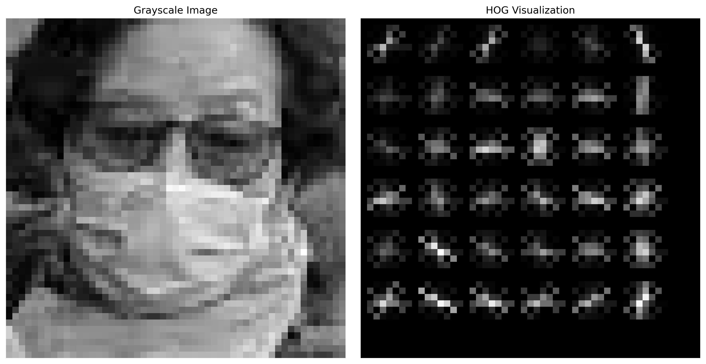
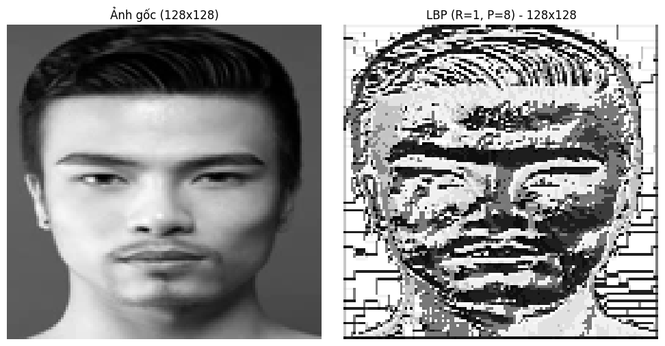

# Face Mask Classification 🎭

**Detecting real-time whether a person wears a face mask using HOG/LBP + RF/SVM**

[]()
[]()

---

## 📋 Table of Contents
- [Overview](#overview)
- [Demo](#demo)
- [Installation](#installation)
- [Usage](#usage)
- [Project Structure](#project-structure)
- [Feature Illustration](#feature-illustration)
- [Classification Report](#classification-report)
- [Contributing](#contributing)
- [License](#license)
- [Contact](#contact)

---

## Overview
This repository, developed for the CS231 course at UIT, aims to detect whether a person is wearing a face mask in real-time. It combines:
- Two feature extraction techniques: HOG & LBP
- Two machine learning models: Random Forest & SVM
- A YOLOv8-based face detector for real-time face localization

---

## Demo
A GIF illustrating the real-time face + mask detection process:


---

## Installation

### 🧰 Prerequisites
- Python ≥ 3.8  
- It is recommended to use a virtual environment:
  ```bash
  python -m venv venv
  source venv/bin/activate  # Linux/macOS
  venv\Scripts\activate   # Windows
  ```

### 🔧 Setup
```bash
git clone https://github.com/your-username/Face-Mask-Classification.git
cd Face-Mask-Classification
pip install -r requirements.txt
```

---

## Usage

### 📦 Using Pre-trained Models
```python
from joblib import load

model = load('models/HOG_SVM_8x2.joblib')
# predictions = model.predict(feature_array)
```
Refer to the guide on building `feature_array` in `example/load-model.ipynb`.

### 📷 Real-Time Detection with YOLOv8-Face
```python
from ultralytics import YOLO
from huggingface_hub import hf_hub_download

repo_id = "arnabdhar/YOLOv8-Face-Detection"
model_path = hf_hub_download(repo_id=repo_id, filename="model.pt")
face_detector = YOLO(model_path)

results = face_detector(frame)
# Extract face → compute features → classify
```

### 🎥 Real-Time Demo Script
```bash
python camera_integration/demo_model_Withdetec.py
```

---

## Project Structure
.
├── camera_integration/         # Real-time demo with camera
│   └── demo_model_Withdetec.py
├── example/                    # Example notebook
│   └── load-model.ipynb
├── images/                     # Illustrations of HOG & LBP
├── models/                     # Pre-trained models
├── src/                        # Code for training/testing:
│   ├── HOG_RandomForest/
│   ├── HOG_SVM/
│   ├── LBP_RandomForest/
│   └── LBP_SVM/
├── LICENSE
└── requirements.txt

---

## Feature Illustration
- **HOG Features**  
  
- **LBP Features**  
  

---

## Classification Report

| Model                 | Precision | Recall | F1‑Score | Accuracy |
|-----------------------|:---------:|:------:|:--------:|:--------:|
| HOG + Random Forest   | 0.98      | 0.98   | 0.98     | 0.98     |
| HOG + SVM             | 0.99      | 0.99   | 0.99     | 0.99     |
| LBP + Random Forest   | 0.97      | 0.97   | 0.97     | 0.97     |
| LBP + SVM             | 0.97      | 0.97   | 0.97     | 0.97     |

---

## Contributing
We welcome all contributions! Please:
1. Fork the repository
2. Create a new branch (`feature/xxx` or `fix/xxx`)
3. Write code/tests, ensuring proper style
4. Create a Pull Request with a detailed description

---

## License
Under the MIT license. See the [LICENSE](LICENSE) file for details.

---

## Contact
- CS231 – University of Information Technology (UIT)
- Contributors: UIT-ChickenPlusPlus
- Email: 23521672@gm.uit.edu.vn

---

## Acknowledgements
- Face Mask 12K Images Dataset (Kaggle)
- Course CS231 – UIT
